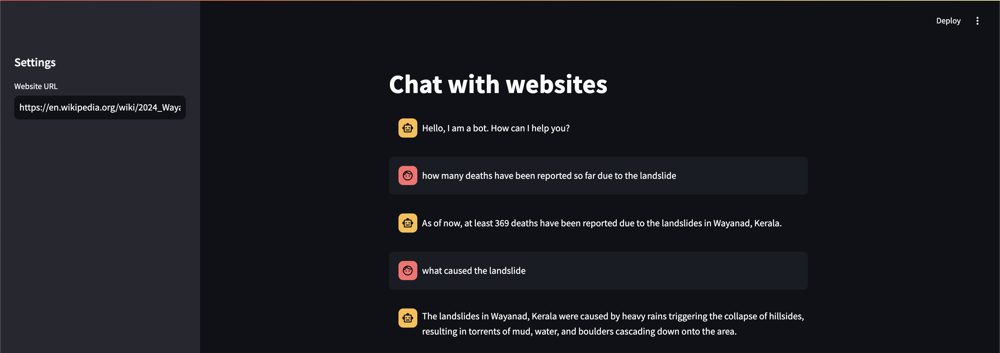

<!DOCTYPE html>
<html lang="en">
<head>
    <meta charset="UTF-8">
    <meta name="viewport" content="width=device-width, initial-scale=1.0">
</head>
<body>
    <h1>Chat With Websites</h1>
    <h2>Overview</h2>
    
<strong>Chat With Websites</strong> is a Streamlit application that allows users to interact with the content of any website using a conversational interface. The application leverages Langchain and OpenAI technologies to retrieve and process information from the specified websites, providing users with relevant responses based on their queries.

 

 <h2>Features</h2>
    <ul>
        <li><strong>Website Interaction:</strong> Input any website URL to extract and interact with its content.</li>
        <li><strong>Conversational Interface:</strong> Engage in a natural language conversation with the chatbot.</li>
        <li><strong>Persistent Chat History:</strong> Maintain chat history throughout the session for context-aware responses.</li>
        <li><strong>Vector Store Integration:</strong> Uses Chroma to create a vector store from website content for efficient information retrieval.</li>
        <li><strong>OpenAI Embeddings:</strong> Converts text chunks into numerical representations for semantic search.</li>
        <li><strong>Responsive UI:</strong> Built with Streamlit for a responsive and user-friendly interface.</li>
    </ul>
</body>
</html>
